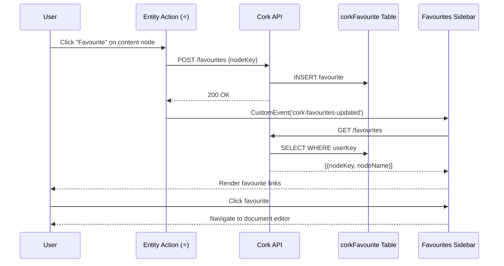

```mermaid
sequenceDiagram
    participant User
    participant EA as Entity Action (⭐)
    participant API as Cork API
    participant DB as corkFavourite Table
    participant SB as Favourites Sidebar

    User->>EA: Click "Favourite" on content node
    EA->>API: POST /favourites {nodeKey}
    API->>DB: INSERT favourite
    API-->>EA: 200 OK
    EA->>SB: CustomEvent('cork-favourites-updated')
    SB->>API: GET /favourites
    API->>DB: SELECT WHERE userKey
    API-->>SB: [{nodeKey, nodeName}]
    SB-->>User: Render favourite links
    User->>SB: Click favourite
    SB-->>User: Navigate to document editor
```